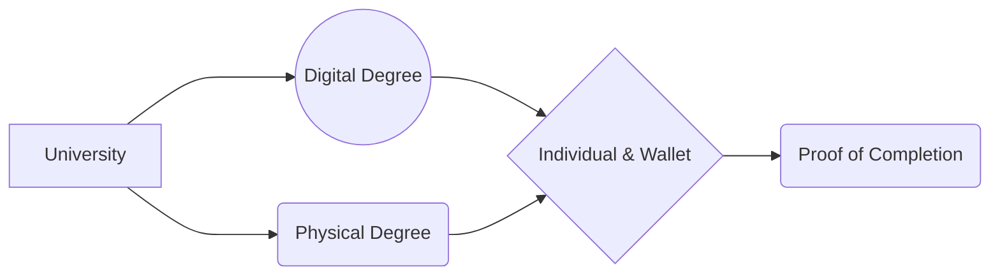

# ACCred - Advanced Crypto Accreditation

#### TLDR

ACCred is an easy to use method to prove an individual has received their accreditation from a specific Institution.

### More About ACCred

ACCred's mission is to bring trust to every digital document by providing a secure and reliable platform for issuing, storing, and verifying digital credentials. The company recognizes that the traditional paper-based credentials can be easily lost, forged, or manipulated, leading to a lack of trust in the authenticity of the credentials. ACCred's solution is to use blockchain technology and open badges to create tamper-proof digital credentials that are verifiable with a single click.

One of the specific challenges that ACCred is trying to address in the digital credentialing space is the lack of standardization and interoperability. Many organizations and institutions issue their own credentials, which can vary widely in terms of format, content, and verification methods. This fragmentation can create confusion for individuals and employers trying to understand the value of a credential. ACCred's platform helps to solve this challenge by providing a standardized format for digital credentials and a universal verification system that can be used across multiple industries and applications.

#### Case studies of ACCred's platform in action:

ACCred's platform has been used in a variety of industries, including healthcare, online learning, and employee records. In the healthcare industry, ACCred's platform has been used to issue and verify digital credentials for healthcare professionals, such as doctors and nurses. This has made it easier for hospitals and healthcare providers to quickly verify the credentials of their staff, reducing the risk of errors or fraud.

In the online learning industry, ACCred's platform has been used by universities and other educational institutions to issue digital badges and certificates to students who complete courses or programs. These credentials can be easily shared on social media or online platforms, providing a convenient way for students to showcase their achievements to potential employers.

#### Comparison with other digital credentialing platforms:

One of the key features that sets ACCred apart from other digital credentialing platforms is its use of blockchain technology. By leveraging the security and transparency of blockchain, ACCred is able to create tamper-proof digital credentials that are verifiable with a single click. This provides a higher level of trust and assurance than other credentialing platforms that rely on less secure methods of verification.

ACCred's platform also offers a high degree of interoperability, which allows digital credentials to be easily shared and verified across multiple applications and systems. This is particularly useful in industries where credentials are often issued and verified by different organizations or institutions.

In terms of ease of use, ACCred's platform is designed to be user-friendly and accessible to individuals and organizations of all sizes. The platform offers a range of customization options, allowing organizations to create digital credentials that reflect their unique branding and messaging.

#### Future plans for ACCred:

ACCred's future plans include expanding into new industries and regions, as well as adding new features and functionalities to its platform. The company is actively exploring opportunities in the legal, government, and financial services industries, where there is a growing demand for secure and reliable digital credentials.

ACCred is also planning to add new verification methods to its platform, such as biometric authentication and artificial intelligence-based verification. These technologies will further enhance the security and reliability of ACCred's digital credentials, making them even more difficult to forge or manipulate.

In addition, ACCred is exploring ways to integrate its platform with other blockchain-based systems and applications, such as supply chain management and digital identity systems. By leveraging the power of blockchain technology, ACCred aims to create a more secure and trustworthy digital ecosystem for individuals and organizations around the world.
